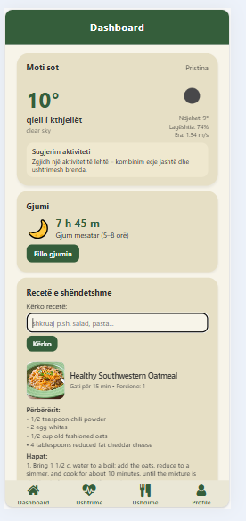
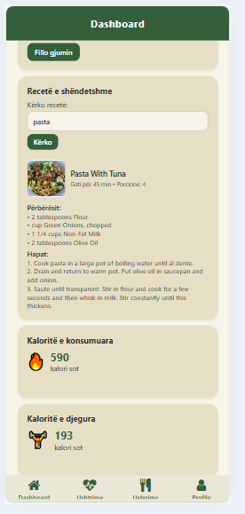

# 📱Personal Health Tracker App
- Personal Health Tracker është një aplikacion mobil i ndërtuar për t’i ndihmuar përdoruesit të kujdesen për shëndetin e tyre ditor. Aplikacioni kombinon ushqimin, ushtrimet, gjumin, dhe recetat ushqimore në një vend të vetëm, duke krijuar një përvojë të thjeshtë dhe praktike për menaxhimin e stilit të jetesës.
- Përdoruesi krijon llogarinë e tij dhe aplikacioni i personalizohet automatikisht: çdo ditë ai mund të regjistrojë çfarë ka ngrënë, çfarë ushtrimesh ka bërë, sa ka fjetur, sa hapa ka bërë, dhe t’i shohë statistikat menjëherë në dashboard.
- Aplikacioni ofron edhe plane ushqimore dhe ushtrimesh të ndara sipas qëllimit personal (humbje peshe, shtim peshe, ruajtje peshe), si dhe sjell receta të gatshme nga API të jashtme, duke e bërë planifikimin e ditës shumë më të lehtë.
-Personal Health Tracker është i dizajnuar të jetë i thjeshtë për t'u përdorur, vizualisht i qartë, dhe i përshtatur për secilin përdorues individualisht. Qëllimi kryesor i tij është të krijojë një mënyrë të shpejtë dhe të lehtë për të ndjekur progresin shëndetësor dhe për të motivuar përdoruesin drejt një stili më të shëndetshëm jetese.
----------------------------------------------------------------------------------------------------------
## Screenshots

### Admin View

  
  
  
  

### User View

  
  
  
  

  
  
  
    
    

